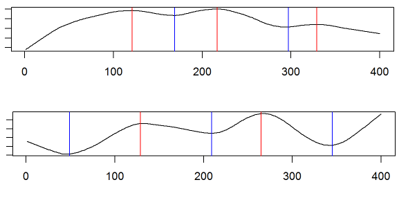

Time Series Analysis - profiling using max & min
======



### Introduction
<br>
  Time series has **maximum** and **minimum** points as general patterns. Sometimes the noise present on it causes problems to spot general behavior.

  In this post, we will **smooth** time series -reducing noise- to maximize the story that data has to tell us. And then, an easy formula will be applied to find and plot max/min points thus characterize data.

### What we have
```{r}
# reading data sources, 2 time series
t1=read.csv("ts_1.txt")
t2=read.csv("ts_2.txt")


# plotting...
plot(t1$ts1, type = 'l')
plot(t2$ts2, type = 'l')

```

  As you can see there are many peaks, but intuitively you can imagine a more smoother line crossing in the middle of the points. This can achieved by applying an *Seasonal Trend Decomposition* (STL).

### Smoothing the series
```{r}
# first create the time series object, with frequency = 50, and then apply the stl function.
stl_1=stl(ts(t1$ts1, frequency=50), "periodic")
stl_2=stl(ts(t2$ts2, frequency=50), "periodic")
```
*Important*: If you don't know the `frequency` beforehand, play a little bit with this parameter until you find a result in which you are comfortable.

<a href="https://anomaly.io/seasonal-trend-decomposition-in-r" target="blank">More STL info</a>  


### Finding max and min
Creating the functions...
```{r}
ts_max<-function(signal)
{
  points_max=which(diff(sign(diff(signal)))==-2)+1
  return(points_max)
}

ts_min<-function(signal)
{
  points_min=which(diff(sign(diff(-signal)))==-2)+1
  return(points_min)
}
```

### Visualizing the results!
```{r}
trend_1=as.numeric(stl_1$time.series[,2])

max_1=ts_max(trend_1)
min_1=ts_min(trend_1)
	

## Plotting final results
plot(trend_1, type = 'l') 
abline(v=max_1, col="red") 
abline(v=min_1, col="blue")

```

With the line: `stl_1$time.series[,2]` we are accessing to the time series `trend` component. This is the smoothing method we will use, but there are others.

This first series has 3 maximums _(red line)_ and 2 minimum _(blue line)_ in the following places:

```{r}
# Max points:
max_1

# Min points:
min_1
```


### Comparing two time series

```{r}
trend_2=as.numeric(stl_2$time.series[,2])

max_2=ts_max(trend_2)
min_2=ts_min(trend_2)

# create two aligned plots	
par(mfrow=c(2,1))

## Plotting series 1
plot(trend_1, type = 'l') 
abline(v=max_1, col="red") 
abline(v=min_1, col="blue")

## Plotting series 2
plot(trend_2, type = 'l') 
abline(v=max_2, col="red") 
abline(v=min_2, col="blue")

```

Some **conclusions** from both plots:
* series 2 starts with a minimum while 1 does with a maximum 
* series 1 has 3 max and 2 min, just the opposite to the other series

Last points are important because...

### What is this data about?


`ts1` and `ts2` are two typical responses to a brain stimulus, in other words: what happen with the brain when a person look at a picture / move a finger / think in a particular thing, etc...

More info: <a href="https://en.wikipedia.org/wiki/Electroencephalography" target="blank">Electroencephalography</a>

  Some studies in **neurosciences** focus on averaging several responses to one stimulus -for example, to look at one particular picture. They present several times a particular image to the person. Averaging all of these signal/time series, you get the **typical response**.
  
  Then you can **predict** based on the similarity between this **typical response** and the **new image** (stimulus) that the person is looking at. 

More info: <a href="https://en.wikipedia.org/wiki/Event-related_potential" target="blank">Event related potential</a>  

Typically there are 400 points per stimulus (1 per millisecond), therefore each plot has 400 points. 
  
  One technique to compare two time series: <a href="http://dtw.r-forge.r-project.org/" target="blank">Dynamic Time Warp</a>  


